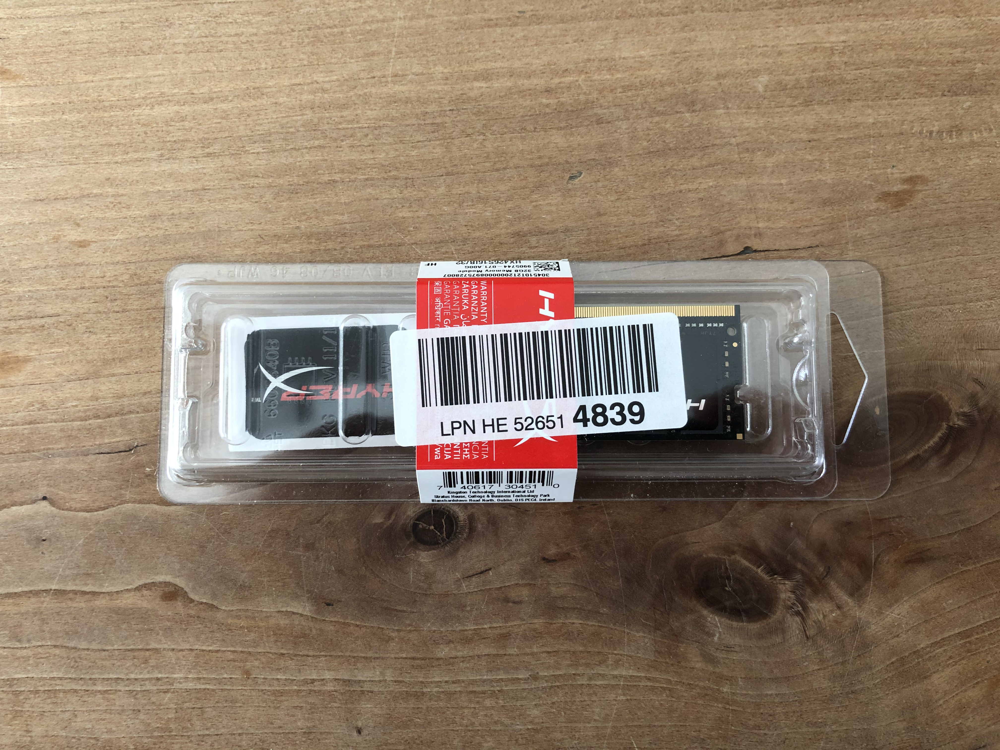
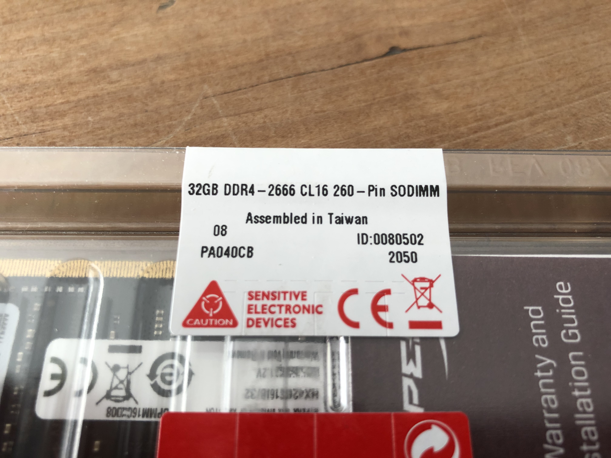
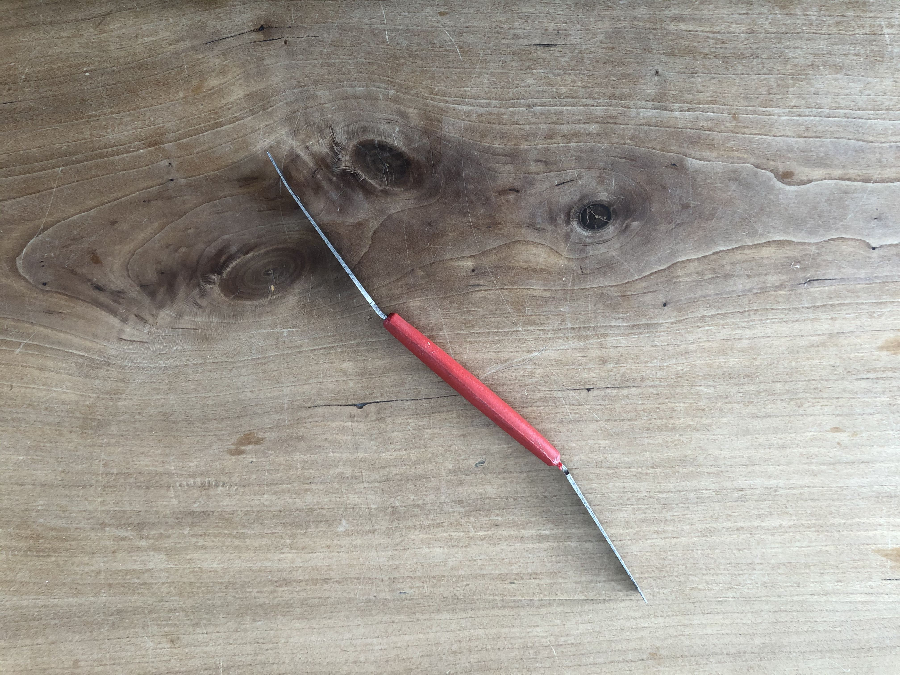
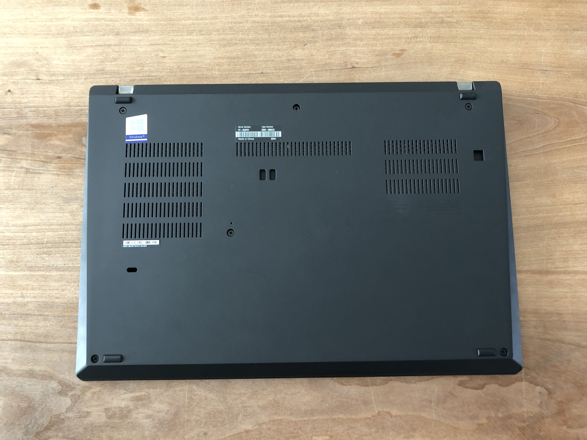
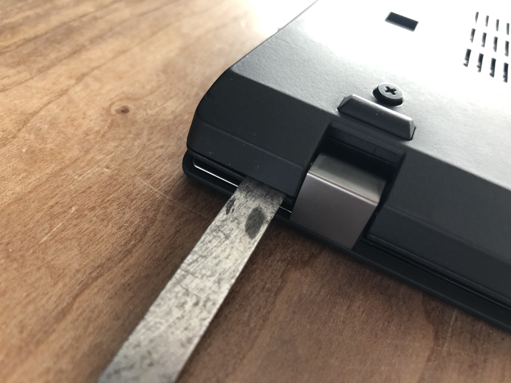
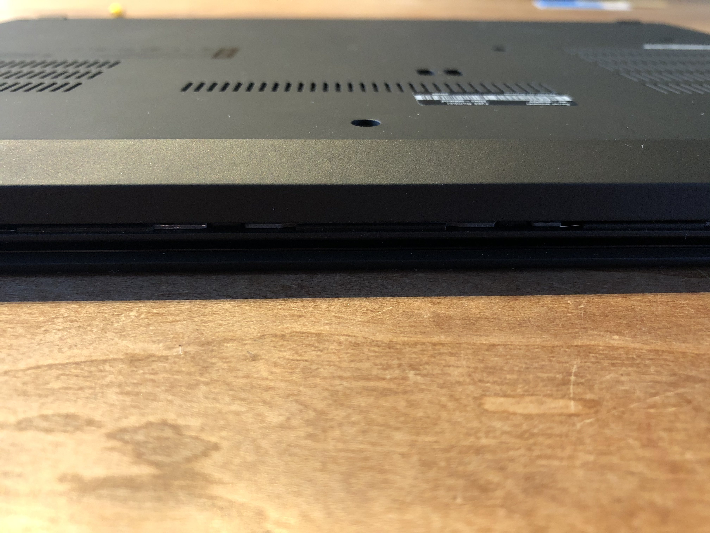
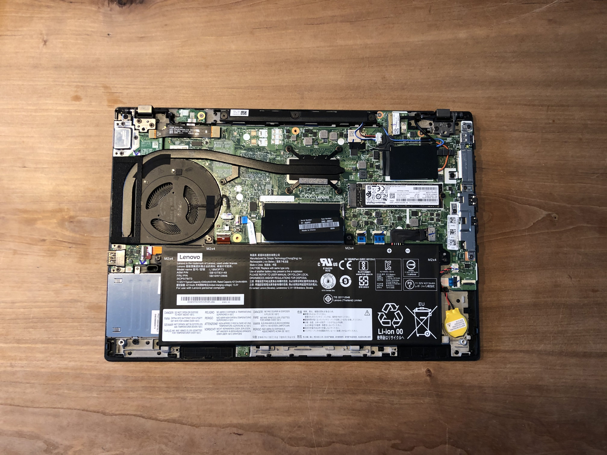
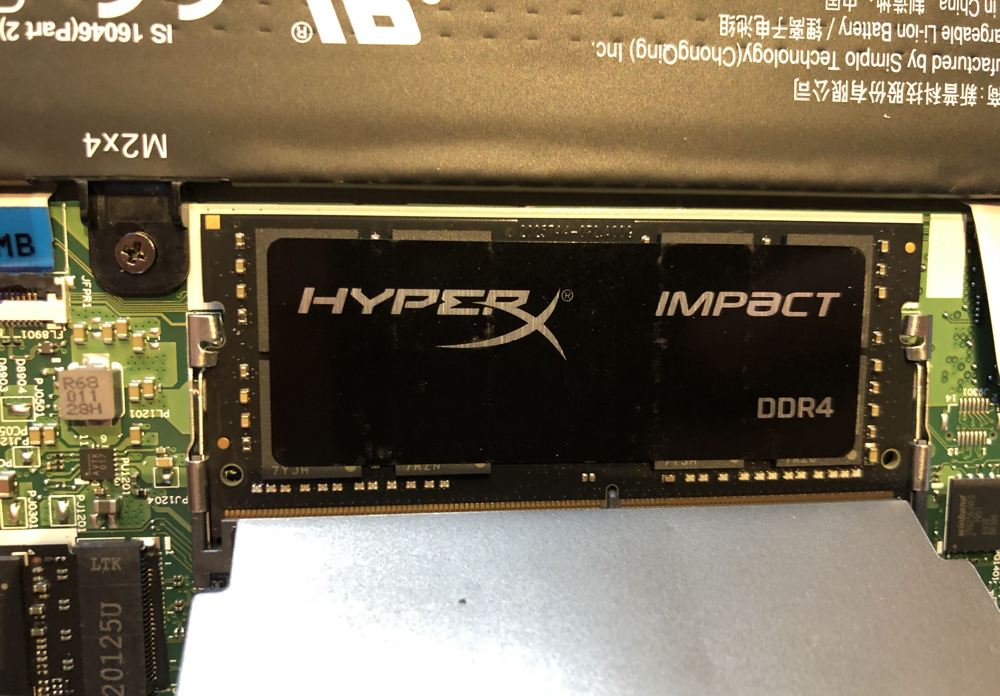
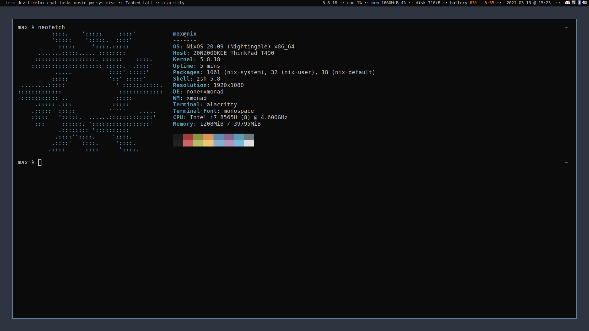

Since hardware prices stay increasing and i got to the limit of 16GB fairly often, i decided to buy a
new RAM Card and to install it into my T490. I'll go over what you should consider when choosing a Card
to buy and how to install it into the T490. Even though this is a T490 specifc tutorial, the most parts
should apply to other ThinkPad models aswell.

## Prerequisites

Before we spend money on a (maybe useless) upgrade, ask yourself if you really need more RAM? How much
more do you need? When doing regular software development most people would argue that 16gb are a sweet
spot. You should monitor your RAM usage and see what really slows you down before upgrading; Do you really
write to the swap often?

I am saying this since upgrading to 40gb is a bit overkill for my usecase; Buying a new 16gb Card would've
probably enough for my day to day tasks, since i have 8gb builtin i would've ended up at 24gb for half of
the price. The only reason for buying a 32gb Card is the fact that the T490 has only one upgradable RAM slot.
If i would feel the need of upgrading again with 24gb, i would still need to buy a 32gb card to replace the
16gb card.

So i assume by now you know how big the new RAM Card should be, so we can move on to the other important
aspects to consider when choosing a RAM Card.

## Which RAM?

Choosing a RAM to buy can be an overwhelming task; Different sizes, types, vendors, clock speeds etc. make
it hard to decide – so how do you know which one you need for your model?

### Type

We'll start with the most important thing to look for when buying RAM; Which one actually fits into my
laptop? The answer for the T490 (and most other modern ThinkPads) is ```DDR4 SODIMM with 260 Pins```.
[SODIMM](https://de.wikipedia.org/wiki/Small_Outline_Dual_Inline_Memory_Module) is a compact RAM Type built
for Laptops; They are a lot shorter and a little wider than the typical RAM Cards we're used to by desktop
pc's.

Anyway: You should do some research and look into your vendors manual to find the RAM Type which will fit
into your model. **If you buy the wrong RAM Type you wont be able to install it since the slot's differ; So
pay attention to this.**

### MHz

Another key fact which many people look at (besides the actual RAM Size) is the MHz (or clock speed) of a
RAM Card. Typical RAM Speeds are ```2400MHz```, ```2666MHz```, ```2933MHz``` and ```3200MHz```. As usual the
higher the number, the higher the price. But even if you dont care about a few bucks you **need** to check
your installation environment before choosing one. As mentioned in this [post](https://forum.thinkpads.com/viewtopic.php?t=121924)
RAM speeds align to another, to the slowest of the ones installed. So if you have a builtin RAM Card with
```2666MHz``` which the T490 has, there is no point in buying anything above that – it's just a waste of money.
You wont notice a speed difference.

To find out your RAM speed you can either use ```lshw``` or look into your manual.

### CAS Latency / CL

The last thing which kind of plays into performance of your system is the *Column Access Strobe Latency* or
*CL* –  this number indicates the latency for accessing a column in the RAM. This is a whole topic and i wont
go into it by detail. Just keep in mind that cheaper RAM Cards might have bad CL value. More about that
[here](https://de.wikipedia.org/wiki/Column_Address_Strobe_Latency).

---

So after considering all of the aspects above, i'v chosen the ```32gb 2666MHz CL16 HyperX DDR4 SODIMM RAM``` -
you can find it [here](https://www.amazon.de/dp/B0848M8R48?m=A3JWKAKR8XB7XF). What did you choose? :)




## Installation

### Tools

Before we start we need a screwer and a utility tool to remove the casing without damaging it. So *dont use*
*a knife* idealy use a plastic tool or somthing which is **thin and dull**.



In my case, i've used a thin metal tool which is pointed on one side and flat on the other. I'v loosened the
screws using the pointed side.

### Opening your T490

> **Important:** If you have a T490 Model with a SIM Card Slot: Remove the SIM Card Holder and put it to the side.

Make sure to completly turn of your Laptop and lay it on the back.



There are 6 screws which need to be loosened in the first step. One in each corner and two in the middle.
These screws stay in the casing – you just need to loosen them – dont remove these. After we successfuly
did that we can move on and loosen the casing by sticking our thin tool into the gap between the keyboard
and the actual casing.



If you've got to this point: Slowly leverage the case of the keyboard by losening the pins which it uses to
stay attached. You need to do that around the whole laptop. Make sure to be gentle to prevent scratches and
damaging to the mainboard or ports. If everything went well the gap should be around this big:



Make sure you did'nt left out any spots (especially between the ports). If you are sure about that you can
now start removing the case slowly to the top. There shouldn't be any resistance.



Now we can swap out the actual RAM Cards. The slot for this model is in the center of the mainboard, hidden
by a dark metal layer (the one with the serial number).

To remove the old card you need to fold the layer back and push the two metal pins to the side which prevent
the card from removal. Then you can just pull it out. Inserting the new one is straight forward: You can just
put it in a 45 degree angle inside and press it slowly down until the metal pins lock in.



You can just put the old RAM Card to the side and close the case again but simply laying it on top of the
mainboard and pushing it gently down. Then you need to tighten the screws again and boom – you've successfully
upgraded your RAM.

> Note: If you took out your SIM Card Holder at the begining, make sure to insert it again or your Laptop wont
> turn on.



